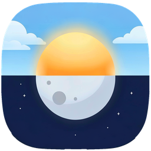

#  DayNight

A tiny 1-click macOS menu bar switch for Light/Dark theme.

As macOS's built-in auto mode gives you little control over this, DayNight replaces that with one click whenever you want it.

## Requirements

- macOS 13 or newer
- Xcode command line tools: `xcode-select --install`)
- Permission to control System Events

## Build

```sh
make app
```

The app is assembled at `build/DayNight.app`.

## Install

```sh
# build, install to `/Applications/DayNight.app` and launch the app
make install
```

Pass `AUTOLOAD=1` if you want it to launch automatically:

```sh
make install AUTOLOAD=1
```

## Uninstall

```sh
make uninstall
```

Quits DayNight, removes it from Login Items if present, and deletes `/Applications/DayNight.app`.

## License

MIT — see [LICENSE](LICENSE).
